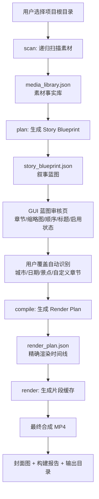
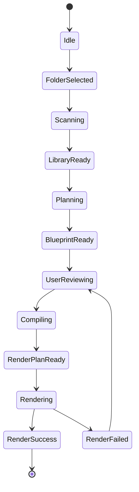

# Video Create Studio V5 最终工程设计文档

**副标题：** 素材库 · 故事蓝图 · 渲染计划 · GUI 工作台 · Python CLI 协议  
**版本：** V5 Engineering Design Final Draft  
**适用项目：** `utertop/video-create` / Video Create Studio  
**文档日期：** 2026-05-11  
**目标读者：** 产品设计、前端 GUI、Tauri 后端、Python 渲染引擎、后续 AI 能力设计

---

## 0. 文档定位与最终结论

V5 的核心不是继续把更多参数塞进命令行，而是把 Video Create Studio 从“调用一个 Python 脚本的桌面壳”升级成一个有工程闭环的内容生产工作台。

V5 的最终架构结论：

```text
Media Library  管素材事实
Story Blueprint 管叙事意图
Render Plan     管渲染执行
GUI Workbench   管用户审核与调整
Python Engine   管扫描、规划、编译和渲染
```

V5 的分层目标：

| 层级 | 负责内容 | 不应该负责 |
|---|---|---|
| Media Library | 文件事实、目录结构、EXIF、尺寸、时长、缓存 key、可用性 | 不决定最终故事顺序 |
| Story Blueprint | 城市/日期/景点章节、节奏、叙事角色、用户覆盖、风格模板 | 不直接执行视频渲染 |
| Render Plan | 精确时间线、片段参数、转场、背景、音频、水印、缓存依赖 | 不再做复杂目录推断 |
| GUI | 可视化审核、拖拽调整、启用/禁用、参数修改、状态展示 | 不直接处理视频编码 |
| Python CLI | scan/plan/compile/render/all/validate/clean-cache | 不做用户界面决策 |

V5 的优先级落地原则：

```text
P0：Render Plan 层、JSON schema 版本号、缓存失效规则
P1：GUI 蓝图审核页、用户覆盖自动识别逻辑
P2：更复杂的视频风格模板
```

---

## 1. V5 数据流总览图

### 1.1 总体数据流



### 1.2 V5 为什么必须增加 Render Plan 层

V4 的 Story Blueprint 已经能描述“视频想怎么讲”，但它不应该直接被渲染器执行。原因如下：

1. Story Blueprint 是用户可读、可编辑、偏产品表达的数据。
2. Render Plan 是机器可执行、参数确定、偏工程执行的数据。
3. GUI 修改章节标题或顺序时，不应该影响底层素材事实。
4. 渲染缓存必须依赖精确参数，例如 duration、transition、background、watermark、engine、quality。
5. 后续加入 AI 配乐、字幕、多轨时间线时，Render Plan 是最稳定的扩展点。

因此 V5 强制采用三层数据模型：

```text
media_library.json      记录“有什么素材”
story_blueprint.json    记录“想讲什么故事”
render_plan.json        记录“具体怎么渲染”
```

### 1.3 V5 推荐执行流程

```text
第一步：scan
    输入素材目录，输出 media_library.json。

第二步：plan
    根据素材库和组织策略生成 story_blueprint.json。

第三步：GUI Review
    用户审核章节、标题、素材入选、顺序、节奏、风格。

第四步：compile
    把 story_blueprint.json 编译成 render_plan.json。

第五步：render
    根据 render_plan.json 生成最终视频、封面和构建报告。
```

---

## 2. Media Library JSON Schema

### 2.1 设计目标

Media Library 是 V5 的素材事实库。它不负责“讲故事”，只负责稳定记录项目中的素材事实。

它需要回答：

```text
项目里有哪些文件？
文件在什么目录？
目录被识别成城市、日期、景点还是普通章节？
每个素材是什么类型？图片还是视频？
尺寸、方向、时长、EXIF、文件 hash 是什么？
素材是否可用？是否被过滤？
缓存是否还能复用？
用户是否覆盖过自动识别结果？
```

### 2.2 顶层结构

```json
{
  "schema_version": "5.0.0",
  "document_type": "media_library",
  "library_id": "lib_20260511_001",
  "engine_version": "video-create-engine-v5",
  "project": {
    "project_id": "project_quanzhou_xiamen",
    "title": "福建-泉州-厦门",
    "source_root": "E:/bilibili_create/泉州-厦门",
    "created_at": "2026-05-11T10:00:00+08:00"
  },
  "scan_config": {
    "recursive": true,
    "ignore_duplicate_suffix": true,
    "ignore_hidden_files": true,
    "organization_hint": "auto",
    "supported_image_exts": [".jpg", ".jpeg", ".png", ".webp", ".bmp"],
    "supported_video_exts": [".mp4", ".mov", ".avi", ".mkv", ".m4v"]
  },
  "directory_nodes": [],
  "assets": [],
  "scan_summary": {},
  "cache_policy": {}
}
```

### 2.3 directory_nodes Schema

目录节点用于描述目录结构和自动识别结果。V5 不能只识别目录名，还必须记录置信度和用户覆盖状态。

```json
{
  "node_id": "dir_001",
  "name": "泉州",
  "relative_path": "泉州",
  "depth": 1,
  "parent_id": null,
  "detected_type": "city",
  "confidence": 0.94,
  "detection_reason": "目录名匹配城市词典",
  "auto_detected": true,
  "user_overridden": false,
  "user_type": null,
  "display_title": "泉州",
  "sort_index": 10,
  "asset_count": 128,
  "children": ["dir_002", "dir_003"]
}
```

字段说明：

| 字段 | 类型 | 说明 |
|---|---|---|
| node_id | string | 目录节点唯一 ID |
| name | string | 原始目录名 |
| relative_path | string | 相对项目根目录路径 |
| depth | number | 目录深度 |
| detected_type | enum | city/date/scenic_spot/chapter/mixed/unknown |
| confidence | number | 0~1 置信度 |
| detection_reason | string | 自动识别依据 |
| auto_detected | boolean | 是否自动识别 |
| user_overridden | boolean | 是否被用户手动覆盖 |
| user_type | enum/null | 用户覆盖后的类型 |
| display_title | string | GUI 展示标题 |
| sort_index | number | 展示排序 |
| asset_count | number | 目录下素材数量 |

### 2.4 目录识别规则优先级

V5 建议采用以下优先级：

| 优先级 | 规则 | 示例 | detected_type |
|---|---|---|---|
| P0 | 用户显式指定 | GUI 选择“按城市组织” | city/date/scenic_spot |
| P1 | 目录名匹配日期 | 2026-05-11、20260511、Day1 | date |
| P2 | 目录名匹配城市词典 | 泉州、厦门、杭州 | city |
| P3 | 目录名匹配景点词典/景点关键词 | 鼓浪屿、开元寺、西街 | scenic_spot |
| P4 | 目录深度推断 | 城市/景点/素材 | scenic_spot |
| P5 | 文件名时间线辅助 | IMG_20260511_001 | date |
| P6 | 无法识别 | misc、selected、raw | chapter/unknown |

建议每次识别都输出：

```json
{
  "detected_type": "city",
  "confidence": 0.94,
  "detection_reason": "目录名匹配城市词典: 泉州"
}
```

### 2.5 assets Schema

```json
{
  "asset_id": "asset_000001",
  "type": "image",
  "relative_path": "泉州/开元寺/P100001.JPG",
  "absolute_path": "E:/bilibili_create/泉州-厦门/泉州/开元寺/P100001.JPG",
  "file": {
    "name": "P100001.JPG",
    "extension": ".jpg",
    "size_bytes": 8450212,
    "modified_time": "2026-05-11T09:20:00+08:00",
    "content_hash": "sha256:..."
  },
  "media": {
    "width": 5184,
    "height": 3888,
    "orientation": "landscape",
    "exif_orientation": 1,
    "duration_seconds": null,
    "has_audio": false
  },
  "classification": {
    "directory_node_id": "dir_002",
    "city": "泉州",
    "date": null,
    "scenic_spot": "开元寺",
    "detected_role": "normal",
    "confidence": 0.88
  },
  "quality_flags": {
    "is_duplicate_candidate": false,
    "is_hidden": false,
    "is_supported": true,
    "is_corrupted": false,
    "is_too_short_video": false,
    "should_ignore": false,
    "ignore_reason": null
  },
  "cache": {
    "asset_fingerprint": "asset_fp_xxx",
    "fixed_image_cache_key": "fix_xxx",
    "blur_background_cache_key": "bg_xxx",
    "segment_cache_key": null
  },
  "user_overrides": {
    "enabled": true,
    "favorite": false,
    "force_include": false,
    "force_exclude": false,
    "custom_title": null,
    "custom_duration": null
  }
}
```

### 2.6 缓存失效规则 P0

缓存不能只看文件名，必须至少基于以下字段生成 cache key：

```text
relative_path
file_size
modified_time
content_hash 可选
render_params
engine_version
schema_version
```

推荐 cache key：

```text
hash(relative_path + size + mtime + params_json + engine_version + schema_version)
```

缓存失效条件：

| 变化项 | 是否失效 | 原因 |
|---|---|---|
| 文件大小变化 | 是 | 素材内容可能变化 |
| 修改时间变化 | 是 | 素材可能被编辑 |
| EXIF 方向变化 | 是 | 固定图需要重建 |
| 背景模糊参数变化 | 是 | 背景图需要重建 |
| 水印变化 | 是 | segment 需要重建 |
| quality/fps/ratio 变化 | 是 | segment 或最终合成需要重建 |
| 仅 GUI 标题变化 | 不一定 | 只影响章节卡或封面 |

---

## 3. Story Blueprint JSON Schema

### 3.1 设计目标

Story Blueprint 是 V5 的叙事蓝图，它描述视频“想怎么讲”。它面向 GUI 和用户，可读、可编辑、可保存。

它回答：

```text
这支视频的主题是什么？
按城市、日期、景点还是自定义章节组织？
有哪些章节？顺序是什么？
每个章节的标题、副标题、节奏、情绪是什么？
哪些素材被选入？哪些被排除？
章节是否启用？是否被用户手动覆盖？
封面候选是什么？水印是什么？整体风格是什么？
```

### 3.2 顶层结构

```json
{
  "schema_version": "5.0.0",
  "document_type": "story_blueprint",
  "blueprint_id": "bp_quanzhou_xiamen_001",
  "source_library_id": "lib_20260511_001",
  "project": {
    "title": "福建-泉州-厦门",
    "subtitle": "古城、海风与旅途记忆",
    "target_platform": "bilibili",
    "target_ratio": "16:9"
  },
  "story_strategy": {
    "organization_mode": "city_date_spot",
    "primary_axis": "city",
    "secondary_axis": "scenic_spot",
    "fallback_axis": "file_time",
    "style_template": "travel_documentary",
    "rhythm": "standard"
  },
  "sections": [],
  "cover": {},
  "watermark": {},
  "global_overrides": {}
}
```

### 3.3 sections Schema

```json
{
  "section_id": "section_quanzhou",
  "section_type": "city",
  "title": "泉州",
  "subtitle": "古城、街巷与烟火气",
  "enabled": true,
  "sort_index": 10,
  "source_directory_node_id": "dir_001",
  "auto_detected": true,
  "user_overridden": false,
  "detection": {
    "detected_type": "city",
    "confidence": 0.94,
    "reason": "目录名匹配城市词典"
  },
  "narrative": {
    "role": "main_chapter",
    "mood": "warm",
    "rhythm": "standard",
    "opening_card": true,
    "closing_card": false
  },
  "asset_refs": [
    {
      "asset_id": "asset_000001",
      "enabled": true,
      "role": "opening",
      "duration_policy": "auto",
      "custom_duration": null,
      "keep_audio": true,
      "user_note": null
    }
  ],
  "children": []
}
```

### 3.4 用户覆盖自动识别 P1

V5 必须明确用户覆盖机制，避免重新 scan/plan 时覆盖用户编辑。

用户覆盖示例：

```json
{
  "section_id": "section_xiamen",
  "title": "海边篇",
  "auto_detected": true,
  "user_overridden": true,
  "user_override_fields": ["title", "section_type", "sort_index"],
  "detection": {
    "detected_type": "city",
    "confidence": 0.91,
    "reason": "目录名匹配城市词典: 厦门"
  }
}
```

合并策略：

| 情况 | 行为 |
|---|---|
| 重新扫描发现新素材 | 自动加入对应 section |
| 重新扫描发现原素材不存在 | 标记 missing，不直接删除 |
| 用户改过章节标题 | 保留用户标题 |
| 用户禁用某素材 | 保留禁用状态 |
| 用户拖拽章节顺序 | 保留 sort_index |
| 自动识别结果变化 | 记录但不覆盖 user_overridden 字段 |

### 3.5 风格模板 P2

V5 先内置少量模板，不做复杂 AI 模板市场。

```json
{
  "style_templates": {
    "travel_documentary": {
      "description": "适合 B站旅行记录，稳重、自然、叙事感强",
      "default_image_duration_range": [2.8, 4.2],
      "transition": "crossfade",
      "background": "blur",
      "chapter_card": "clean_title"
    },
    "fast_vlog": {
      "description": "节奏更快，适合短片和预告",
      "default_image_duration_range": [1.6, 2.8],
      "transition": "quick_crossfade",
      "background": "blur",
      "chapter_card": "minimal"
    },
    "slow_poetic": {
      "description": "慢节奏，适合古城、夜景、海边、氛围感视频",
      "default_image_duration_range": [4.0, 6.0],
      "transition": "soft_fade",
      "background": "blur_dark",
      "chapter_card": "cinematic"
    }
  }
}
```

---

## 4. Render Plan JSON Schema

### 4.1 设计目标

Render Plan 是 V5 的 P0 核心。它是 Story Blueprint 被编译后的机器执行计划。

它回答：

```text
最终视频有哪些 clip？
每个 clip 的输入文件是什么？
每个 clip 的持续时间、转场、背景、裁剪、缩放、水印、音频策略是什么？
片头、章节卡、照片、视频、片尾的精确顺序是什么？
哪些片段可以命中缓存？哪些需要重建？
最终输出参数是什么？
```

### 4.2 顶层结构

```json
{
  "schema_version": "5.0.0",
  "document_type": "render_plan",
  "render_plan_id": "rp_quanzhou_xiamen_001",
  "source_blueprint_id": "bp_quanzhou_xiamen_001",
  "source_library_id": "lib_20260511_001",
  "engine_version": "video-create-engine-v5",
  "output": {
    "output_dir": "E:/bilibili_create/泉州-厦门/output",
    "output_name": "quanzhou_xiamen",
    "video_file": "quanzhou_xiamen_16x9.mp4",
    "cover_file": "cover_quanzhou_xiamen.jpg",
    "report_file": "build_report_quanzhou_xiamen.txt"
  },
  "render_settings": {
    "ratio": "16:9",
    "resolution": [1920, 1080],
    "fps": 30,
    "quality": "high",
    "engine": "auto",
    "codec": "libx264",
    "audio_codec": "aac",
    "pix_fmt": "yuv420p",
    "crf": 20,
    "preset": "medium"
  },
  "timeline": [],
  "cache_policy": {},
  "validation": {}
}
```

### 4.3 timeline clip Schema

```json
{
  "clip_id": "clip_0001",
  "clip_type": "photo",
  "source_asset_id": "asset_000001",
  "source_path": "E:/bilibili_create/泉州-厦门/泉州/P100001.JPG",
  "section_id": "section_quanzhou",
  "duration_seconds": 3.6,
  "start_policy": "append",
  "visual": {
    "fit_mode": "contain",
    "background_mode": "blur",
    "background_blur_radius": 32,
    "background_darkness": 0.30,
    "ken_burns": {
      "enabled": true,
      "zoom_start": 1.0,
      "zoom_end": 1.012
    },
    "exif_transpose": true
  },
  "transition": {
    "type": "crossfade",
    "duration_seconds": 0.5
  },
  "audio": {
    "policy": "silent",
    "keep_source_audio": false,
    "volume": 1.0
  },
  "watermark": {
    "enabled": true,
    "text": "PangBo Travel",
    "position": "bottom_right",
    "opacity": 0.75
  },
  "cache": {
    "cache_key": "segment_xxx",
    "cache_path": ".cache_bilibili_video/segments/segment_xxx.mp4",
    "cache_hit": false,
    "dependencies": ["asset_fp_xxx", "render_params_fp_xxx"]
  }
}
```

### 4.4 clip_type 枚举

| clip_type | 说明 |
|---|---|
| title_card | 全局片头 |
| chapter_card | 章节标题卡 |
| photo | 照片片段 |
| video | 视频片段 |
| end_card | 片尾 |
| spacer | 空白过渡片段，V5 可选 |

### 4.5 Render Plan 校验规则

Render Plan 生成后必须先 validate，再 render。

校验项：

| 校验项 | 等级 | 处理方式 |
|---|---|---|
| schema_version 缺失 | error | 停止 |
| timeline 为空 | error | 停止 |
| source_path 不存在 | error/warn | 默认跳过，报告记录 |
| 视频无法读取 | error/warn | 跳过，报告记录 |
| duration <= 0 | error | 停止或修正 |
| transition > clip duration | warn | 自动缩短 transition |
| cache key 缺失 | warn | 重新生成 |
| output_dir 不存在 | info | 自动创建 |

---

## 5. GUI 页面状态流转

### 5.1 V5 GUI 总体页面

V5 GUI 不再是单页参数表，而是工作台式流程。

```text
首页 / 项目入口
    ↓
素材导入页
    ↓
素材库页 Media Library
    ↓
故事蓝图审核页 Story Blueprint Review
    ↓
渲染设置页 Render Settings
    ↓
任务执行页 Render Progress
    ↓
结果页 Output Review
```

### 5.2 状态机



### 5.3 页面组件设计

#### 5.3.1 素材库页

| 区域 | 组件 | 功能 |
|---|---|---|
| 左侧 | DirectoryTree | 显示城市/日期/景点目录树 |
| 中间 | AssetGrid | 缩略图瀑布流/网格 |
| 右侧 | AssetInspector | 显示尺寸、方向、时长、EXIF、状态 |
| 顶部 | FilterBar | 图片/视频/已过滤/损坏/收藏 |
| 底部 | ScanSummary | 图片数、视频数、预计时长 |

#### 5.3.2 故事蓝图审核页 P1

这是 V5 最重要的 GUI 页面。

| 区域 | 组件 | 功能 |
|---|---|---|
| 左侧 | SectionList | 章节列表：泉州、厦门、Day1、鼓浪屿 |
| 中间 | SectionTimelinePreview | 每章节素材缩略图预览 |
| 右侧 | SectionEditor | 编辑标题、副标题、类型、节奏、启用状态 |
| 底部 | BlueprintCommandPreview | 预估时长、素材数、风险提示 |

用户可操作项：

```text
拖拽章节顺序
启用/禁用章节
编辑章节标题
修改章节类型：城市/日期/景点/普通章节
启用/禁用素材
设置某张图片为封面候选
设置章节节奏：慢/标准/快
选择风格模板：travel_documentary / fast_vlog / slow_poetic
```

### 5.4 用户覆盖逻辑

GUI 每次编辑都要写入 Story Blueprint 的 `user_overridden` 与 `user_override_fields`。

示例：

```json
{
  "section_id": "section_quanzhou",
  "title": "古城泉州",
  "user_overridden": true,
  "user_override_fields": ["title", "subtitle", "rhythm"]
}
```

这样后续重新 scan/plan 时，不会覆盖用户编辑成果。

---

## 6. Python V5 CLI 命令协议

### 6.1 命令总览

V5 Python 引擎建议命名为：

```text
video_engine_v5.py
```

支持命令：

```bash
python video_engine_v5.py scan     --input_folder "E:\xxx" --output media_library.json
python video_engine_v5.py plan     --library media_library.json --output story_blueprint.json
python video_engine_v5.py compile  --library media_library.json --blueprint story_blueprint.json --output render_plan.json
python video_engine_v5.py render   --render_plan render_plan.json
python video_engine_v5.py validate --file render_plan.json
python video_engine_v5.py all      --input_folder "E:\xxx" --output_dir output
python video_engine_v5.py clean-cache --input_folder "E:\xxx"
```

### 6.2 scan 命令

```bash
python video_engine_v5.py scan   --input_folder "E:\bilibili_create\泉州-厦门"   --recursive   --organization_hint auto   --output "E:\bilibili_create\泉州-厦门\media_library.json"
```

输出：`media_library.json`

职责：

```text
递归扫描文件
过滤隐藏文件、副本文件、临时文件
分析图片/视频基础元数据
识别目录类型和置信度
生成素材事实库
计算缓存 fingerprint
```

### 6.3 plan 命令

```bash
python video_engine_v5.py plan   --library media_library.json   --strategy city_date_spot   --style travel_documentary   --output story_blueprint.json
```

职责：

```text
根据 Media Library 生成章节
根据城市/日期/景点组织素材
生成 Story Blueprint
保留用户覆盖字段
生成封面候选
生成每章节默认节奏
```

### 6.4 compile 命令

```bash
python video_engine_v5.py compile   --library media_library.json   --blueprint story_blueprint.json   --ratio 16:9   --quality high   --watermark "PangBo Travel"   --output render_plan.json
```

职责：

```text
把故事蓝图编译为精确时间线
决定每张照片时长
决定每个 clip 的背景、转场、水印、音频策略
生成 cache key
输出 render_plan.json
```

### 6.5 render 命令

```bash
python video_engine_v5.py render   --render_plan render_plan.json   --output_dir "E:\bilibili_create\泉州-厦门\output"
```

职责：

```text
校验 Render Plan
生成或复用片段缓存
合成最终 MP4
生成封面图
生成构建报告
输出结构化事件日志
```

### 6.6 all 快捷命令

CLI 用户可以一条命令完成全部流程：

```bash
python video_engine_v5.py all   --input_folder "E:\bilibili_create\泉州-厦门"   --recursive   --chapters_from_dirs   --title "福建-泉州-厦门"   --watermark "PangBo Travel"   --cover   --quality high   --output_name "quanzhou_xiamen"
```

内部等价于：

```text
scan → plan → compile → render
```

### 6.7 标准事件日志协议

为了方便 Tauri GUI 实时展示进度，Python 必须输出 JSON Lines：

```json
{"event":"scan_started","progress":0,"message":"开始扫描素材"}
{"event":"asset_scanned","progress":18,"asset":"泉州/P100001.JPG"}
{"event":"plan_created","progress":35,"sections":2}
{"event":"render_clip_started","progress":50,"clip_id":"clip_0001"}
{"event":"render_clip_done","progress":52,"clip_id":"clip_0001","cache_hit":true}
{"event":"final_mux_started","progress":90}
{"event":"done","progress":100,"output":"output/quanzhou_xiamen_16x9.mp4"}
```

GUI 不应该解析普通文本日志，而应该优先解析 JSON Lines。

### 6.8 退出码协议

| Exit Code | 含义 |
|---|---|
| 0 | 成功 |
| 1 | 通用错误 |
| 2 | 参数错误 |
| 3 | 输入目录不存在 |
| 4 | 没有可用素材 |
| 5 | JSON schema 校验失败 |
| 6 | 渲染失败 |
| 7 | FFmpeg/MoviePy 环境错误 |
| 8 | 缓存读写错误 |

---

## 7. V5 Action Plan

### Phase 1：P0 数据协议落地

交付物：

```text
media_library.schema.json
story_blueprint.schema.json
render_plan.schema.json
video_engine_v5.py scan
video_engine_v5.py plan
video_engine_v5.py compile
validate 命令
```

验收标准：

```text
能扫描 E:\bilibili_create\泉州-厦门
能生成 media_library.json
能生成 story_blueprint.json
能生成 render_plan.json
render_plan.json 包含完整 timeline
所有 JSON 带 schema_version = 5.0.0
```

### Phase 2：P0 渲染执行与缓存失效

交付物：

```text
render 命令
cache key 生成函数
cache manifest
build_report
最终 MP4 输出
封面输出
```

验收标准：

```text
首次运行生成缓存
二次运行命中缓存
修改单张照片后只重建相关片段
修改 watermark 后重建相关片段
最终视频可正常播放
```

### Phase 3：P1 GUI 蓝图审核页

交付物：

```text
素材库页
故事蓝图审核页
章节编辑器
缩略图预览
用户覆盖字段保存
render plan 生成按钮
```

验收标准：

```text
用户能看到 泉州 / 厦门 章节
用户能修改章节标题
用户能禁用某个章节
用户能拖拽章节顺序
重新 plan 后用户修改不丢失
```

### Phase 4：P2 风格模板增强

交付物：

```text
travel_documentary
fast_vlog
slow_poetic
模板参数映射到 Render Plan
```

验收标准：

```text
不同模板生成不同照片时长、转场和章节卡风格
同一素材能生成不同风格视频
```

---

## 8. V5 最小可行验收用例

### 8.1 测试目录

```text
E:\bilibili_create\泉州-厦门
├── 泉州
│   ├── 开元寺
│   │   ├── P100001.JPG
│   │   └── P100002.JPG
│   └── 西街
│       └── P100003.MP4
└── 厦门
    ├── 鼓浪屿
    │   ├── P200001.JPG
    │   └── P200002.MP4
    └── 环岛路
        └── P200003.JPG
```

### 8.2 预期结果

```text
media_library.json：识别城市=泉州/厦门，景点=开元寺/西街/鼓浪屿/环岛路
story_blueprint.json：生成泉州、厦门两个主章节
render_plan.json：包含 title_card、chapter_card、photo、video、end_card
最终视频：quanzhou_xiamen_16x9.mp4
封面：cover_quanzhou_xiamen.jpg
报告：build_report_quanzhou_xiamen.txt
```

---

## 9. 最终结论

V5 的核心不是“生成视频脚本再加功能”，而是建立一条稳定的工程链路：

```text
目录与素材事实
    ↓
Media Library
    ↓
故事组织与用户意图
    ↓
Story Blueprint
    ↓
机器可执行时间线
    ↓
Render Plan
    ↓
缓存、渲染、输出、报告
```

当这条链路稳定后，后续所有高级能力都可以自然挂载：

```text
AI 选片
AI 配乐
字幕生成
时间线编辑器
模板市场
批量项目
封面风格库
发布平台适配
```

因此 V5 的最终目标是：

```text
把 Video Create Studio 从“脚本 GUI”升级成“面向内容创作者的视频生产工作台”。
```
